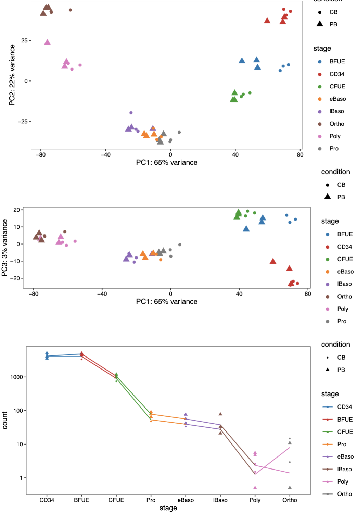

# LIN28B/IGF2BP3

Shiny: [https://sankaranlab.shinyapps.io/volcanoplot/](https://sankaranlab.shinyapps.io/volcanoplot/)

Repositories containing cord blood and peripheral blood sequence reads:

* [GSE107218](https://www.ncbi.nlm.nih.gov/geo/query/acc.cgi?acc=GSE107218) 
* [GSE61566](https://www.ncbi.nlm.nih.gov/geo/query/acc.cgi?acc=GSE61566%20) 
* [GSE53983](https://www.ncbi.nlm.nih.gov/geo/query/acc.cgi?acc=GSE53983)

Tools:

* STAR and RSEM: Align to reference transcripts, and create a gene-level counts matrix
* DESeq2: gene-level RNA-seq differential expression

Gene-level processed counts matrix: [https://raw.githubusercontent.com/kopal-garg/resources/master/countData\_Yan.tsv](https://raw.githubusercontent.com/kopal-garg/resources/master/countData_Yan.tsv)

DESeq2: Time-series analysis

```text
# DESeqDataSet object 
dds = DESeqDataSetFromMatrix(countData = round(txi.rsem$counts),
                       colData = samples,
                       design= ~ condition + time)

# remove rows w/ no counts or only 1 count across all samples
keep <- rowSums(counts(dds)) > 1 
dds <- dds[keep,] # from 60662 to 33303

# VST
vsd <- vst(dds, blind = FALSE)

# rlog-transformation
rld <- rlog(dds, blind = FALSE)

# estimate size factors for log2(count + 1)
dds <- estimateSizeFactors(dds)

df <- bind_rows(
  as_tibble(log2(counts(dds, normalized=TRUE)[, 2:3]+1)) %>%
    mutate(transformation = "log2(x + 1)"),
  as_tibble(assay(vsd)[, 1:2]) %>% mutate(transformation = "vst"),
  as_tibble(assay(rld)[, 1:2]) %>% mutate(transformation = "rlog"))

colnames(df)[1:2] <- c("x", "y")  
      
```

Quality Control: PCA to determine sources of variation in the data and check for potential outliers

```text
# PCA: using VST
plotPCA(vsd, intgroup = c("condition", "sample"))

pcaData <- plotPCA.san(vsd, intgroup = c( "condition", "sample"), returnData = TRUE)
percentVar <- round(100 * attr(pcaData, "percentVar"))

# specify cell line (symbol) and condition (color)
p3 = ggplot(pcaData, aes(x = PC1, y = PC2, color = condition)) +
  geom_point(size =3) +
  xlab(paste0("PC1: ", percentVar[1], "% variance")) +
  ylab(paste0("PC3: ", percentVar[2], "% variance")) +
  coord_fixed() +
  scale_color_manual(values = jdb_palette("corona")) + pretty_plot()
# MDS
mds <- as.data.frame(colData(vsd))  %>%
  cbind(cmdscale(sampleDistMatrix))
ggplot(mds, aes(x = `1`, y = `2`, color = condition)) +
  geom_point(size = 3) + coord_fixed() + ggtitle("MDS with VST data")

```

Time course analysis

```text
# 9. Time Course

ddsTC <- DESeq(dds)

# resTC = readRDS('resTC.rds')
resTC <- results(ddsTC)
resTC$symbol <- mcols(ddsTC)$symbol

tc <- plotCounts(ddsTC, which.min(resTC$padj), returnData = TRUE)
tc$stage = factor(rep(c('Pro', 'Poly', 'Ortho', 'lBaso', 'eBaso', 'CFUE', 'CD34', 'BFUE'), each = 3))
tc$stage <- factor(tc$stage, levels=c('CD34', 'BFUE', 'CFUE', 'Pro', 
                                      'eBaso', 'lBaso', 'Poly', 'Ortho'))

```



```text
# PCA

p1 = ggplot(pcaData, aes(x = PC1, y = PC2, color = stage, shape = condition)) +
  geom_point(size =3) +
  xlab(paste0("PC1: ", percentVar[1], "% variance")) +
  ylab(paste0("PC3: ", percentVar[2], "% variance")) +
  coord_fixed() +
  scale_color_manual(values = jdb_palette("corona")) + pretty_plot()

# Time course analysis 

p2 = ggplot(tc,
       aes(x = stage, y = count, color = stage, group = condition, shape = condition)) + 
  geom_point() + stat_summary(fun=mean, geom="line") +
  scale_y_log10() + xlab('stage') + ylab('count') + pretty_plot() +
  scale_color_manual(values = jdb_palette("corona")) 

ggsave(grid.arrange(pc1, pc2,p2), file = "out.pdf", width = 7, height = 10)

```

Differential expression analysis

```text
# count data after excluding sex choromosomes 

require(annotables)

grch38 = grch38 %>% 
  dplyr::select(ensgene, symbol, chr, start, end, description) %>%
  subset(., select = c(ensgene, symbol, chr))

countData = countData %>% mutate(symbol=factor(unlist(lapply(strsplit(genes, split = "_"), function(x) x[2])))) %>%
  mutate(ensgene=factor(unlist(lapply(strsplit(genes, split = "_"), function(x) x[1])))) %>%
  mutate(ensgene=factor(unlist(lapply(strsplit(ensgene, split = "\\."), function(x) x[1]))))

countData = inner_join(countData, grch38) %>% filter(!(chr) %in% c('X', 'Y', 'MT')


countData = as.data.frame(round(txi.rsem$counts)) 
countData$genes = rownames(countData)
RNA.counts <- countData[,1:48]
meta <- stringr::str_split_fixed(colnames(RNA.counts), "_", 4)
RNA.counts.df <- as.data.frame(RNA.counts)

colData <- as.data.frame(RNA.condition)
colnames(RNA.counts.df) = RNA.condition
row.names(colData) <- colnames(RNA.counts.df)

conditionPB=as.data.frame(factor(rep(c('Pro_PB', 'Poly_PB', 'Ortho_PB', 'lBaso_PB', 'eBaso_PB', 'CFUE_PB', 'CD34_PB', 'BFUE_PB'), each = 3)))
colnames(conditionPB)='condition'
conditionPB %>% mutate_if(is.factor, as.character) -> conditionPB
conditionCB=as.data.frame(factor(rep(c('Pro_CB', 'Poly_CB', 'Ortho_CB', 'lBaso_CB', 'eBaso_CB', 'CFUE_CB', 'CD34_CB', 'BFUE_CB'), each = 3)))
condition=as.data.frame(condition)
RNA.dds <- DESeqDataSetFromMatrix(countData = RNA.counts.df, colData = condition, design = ~condition)
RNA.dds <- DESeq(RNA.dds)

comp <- expand.grid(unique(condition$condition),unique(condition$condition), stringsAsFactors = FALSE)
comp <- subset(comp, Var1!=Var2)
comp$cond <- "condition"
comp <- comp %>% 
  mutate(key = paste0(pmin(Var1, Var2), "_" ,pmax(Var1, Var2), sep = "")) %>%
  dplyr::distinct(key, .keep_all=TRUE)


sig.pairwise <- function(x) {
  print(x)
  # Do the DESeq contrast
  resSig.RNA <- data.frame(results(RNA.dds, contrast=c(comp[x,3], comp[x,2], comp[x,1]), filterFun=ihw, alpha = 0.01))
  resSig.RNA$gene <- countData$genes
  resSig.RNA %>% filter(complete.cases(.)) %>% arrange(padj) %>% filter(padj < 0.01) -> out
  # Do some rounding
  out$baseMean <- round( out$baseMean, 1)
  out$log2FoldChange <- round( out$log2FoldChange, 1)
  out$pvalue <-sprintf("%.3e", out$pvalue)
  out$padj <-sprintf("%.3e", out$padj)
  # Output table
  out_table = out[,c("gene", "baseMean", "log2FoldChange", "pvalue", "padj")]
  write.table(out[,c("gene", "baseMean", "log2FoldChange", "pvalue", "padj")],
              file = paste0("", comp[x,4], "_Padj01.tsv"), 
              row.names = FALSE, col.names = TRUE, sep = "\t", quote = FALSE)
  comp[x,4]
}

lapply(1:dim(comp)[1], sig.pairwise)

#strongest upregulation
resSig[ order(resSig$log2FoldChange, decreasing = TRUE), ]


```

Differentially expressed results file \(genes in rows, and 4 required columns: raw P values, adjusted P values \(FDR\), log fold change and gene labels\)

Datasets containing lowest p-values \(top 100\):



Volcano Plots: 

log2FoldChange vs -log10\(p-value\)

most upregulated genes are towards the right

most downregulated genes are towards the left

most statistically significant genes are towards the top

```text

volcano_plot <- function(data){
  data = data %>% mutate(symbol=factor(unlist(lapply(strsplit(gene, split = "_"), function(x) x[2]))))
threshold_OE <- data$padj < 0.05
data$threshold <- threshold_OE 
data <- data[order(data$padj), ] 
data$genelabels <- ""
data$genelabels[1:10] <-T

ggplot(data) +
  geom_point(aes(x = log2FoldChange, y = -log10(padj), colour = threshold)) +
  geom_text_repel(aes(x = log2FoldChange, 
                      y = -log10(padj), 
                      label = ifelse(genelabels == T, as.character(symbol),""))) +
  xlab("log2 fold change") + 
  ylab("-log10 adjusted p-value") +
  theme(legend.position = "none",
        plot.title = element_text(size = rel(1.5), hjust = 0.5),
        axis.title = element_text(size = rel(1.25))) +
  pretty_plot()
}

```


